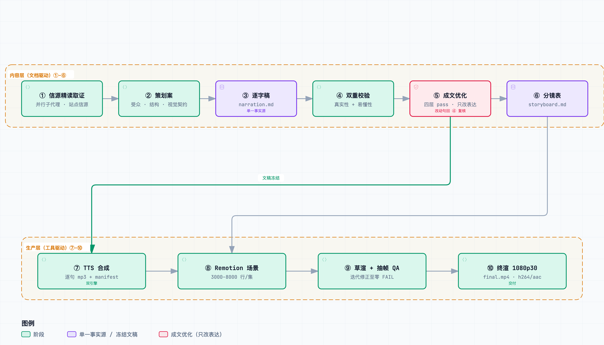

# to-video

[](LICENSE) [](#三安装)

读透一份信源，交付一支 1080p30 的科普视频——由 AI Agent 执行、人做评审决策的十阶段流水线。

**to-video** 是一个可安装的 agent Skill（Claude Code 等）加 Python / Remotion 工具链：把「信源精读 → 逐字稿 → 配音 → 代码动画 → 终渲」固化为十个带通过门的阶段。内容层（①–⑥）的写作阶段产出**可回溯、像人写的逐字稿**（每句口播都能落到信源证据），生产层（⑦–⑩）的工具阶段完成声音克隆配音、React 场景动画、抽帧质检与终渲交付。全片派生自文本单一事实源——改稿后 `build → tts → render` 一条链重跑，全程不打开任何剪辑软件。

<p align="center">
  
</p>

## 一、核心能力

- **IndexTTS-2.5 声音克隆配音**：用 10–14 秒干净样本克隆你自己的音色，风格档控制语气；样本勘探与保真度验收、逐句内容寻址缓存、断点续跑零重复合成（机制见 [references/VOICE-CLONING.md](references/VOICE-CLONING.md)）。无本地模型时可用 edge 预置音色（edge-tts）兜底。
- **Remotion 全代码动画**：每个画面是一个 React 场景组件——可 review、可 diff、可编程复渲；frozen 运动层提供跨集一致的时序语汇（时长令牌 / 缓动 / 弹簧 / 错峰），主题与构图每集独立设计。
- **抽帧 QA 门**：草渲后按幕 / 句 / 末 N 句抽帧，自动体检黑帧、重复帧、安全区侵入与字幕 WCAG 对比度，零 FAIL 才放行终渲——把「渲染缺陷靠肉眼全程盯」压缩为「机器点名 + 定点目检」。
- **archify 动效图例**：架构图（archify Skill 产物，见「相邻 Skill」）逐章录制为视频动效；覆盖门按句级锚定率执法「图与口播互证」，整幕零锚定即 FAIL。
- **字幕导出**：srt / vtt 双格式，cue 终点不含句间停顿——外挂字幕的静默期不留残字。
- **双语版本（zh/en）**：英文逐字稿与主稿句 id 1:1 对齐（分镜/场景全复用，时间轴随英文配音自动重排）、按语言独立的配音槽位与预算门、画面文案轻量 i18n、按语言后缀的渲染与交付归档——`--lang` 一参切换（机制见 [references/PIPELINE.md §五「双语渲染」](references/PIPELINE.md)）。
- **1080p30 终渲交付**：音频 manifest 驱动全片时间轴，零手工对轨；时序常数单一事实源（timing.json），TS 与 Python 两侧共读，双语言镜像漂移结构性不存在。

## 二、流水线总览

<picture>
  <source media="(prefers-color-scheme: dark)" srcset="docs/assets/architecture/pipeline-layers-dark.png">
  
</picture>

①–⑥ 为**内容层**（写作产物，由人/代理撰写），⑦–⑩ 为**生产层**（由工具执行）：

| 阶段 | 产出 · 通过门 |
| --- | --- |
| ① 信源精读取证 | 取证笔记——全部断言可回溯；RISKY=0 |
| ② 策划案生成 | planning.md 六节齐 |
| ③ 逐字稿写作 | narration.md（全片单一事实源），`build` 派生 narration.json |
| ④ 双重校验 | 真实性 + 易懂性双门（`check`）：RISKY=0 且 REWRITE=0 |
| ⑤ 成文优化 | 研究笔记 / 策划案 / 逐字稿 / 分镜按「结构 → 衔接 → 句子 → 词句」四层改成人写模样，只改表达不改事实：成文评审 REWRITE=0 且改动句复核 RISKY=0 |
| ⑥ 分镜表生成 | beat 覆盖率无缺句（`check`，含分镜↔代码互比） |
| ⑦ TTS 配音 | 逐句 mp3 + 时长 manifest（`tts`，幂等续跑），`captions` 导出 srt/vtt |
| ⑧ Remotion 场景实现 | React 场景组件、全代码动画：tsc 零错误 + 七条渲染红线 + 运动层铁律 |
| ⑨ 草渲 + 抽帧 QA | 半分辨率 draft.mp4 + 抽帧自动体检（`render` / `qa`）零 FAIL，含尾幕渐黑必查 |
| ⑩ 终渲与交付 | 1080p30 final.mp4（`render --final`）+ `deliver` 按系列子目录与集标题 vN 归档到可配根路径，实测时长落在预算窗内 |

全部阶段的唯一声明源是 [`references/stages.toml`](references/stages.toml)，本表是它的人读视图；每阶段的代理规格见 [`references/`](references/)。

## 三、安装

Skill 本体是纯指令，零依赖即装即用；下表工具链仅运行流水线时需要。

### 前置依赖（Prerequisites）

| 依赖 | 说明 |
| --- | --- |
| macOS 渲染主机 | 场景字体走系统 CJK 字体栈（PingFang SC / Songti SC / SF Mono），未内嵌字体文件，渲染与抽帧 QA 仅支持 macOS |
| [uv](https://docs.astral.sh/uv/) | 运行全部 Python 脚本（`uv run --no-project --with …` 按需取依赖，无需预装环境） |
| pnpm ≥ 12 | 分集 Remotion 工程的依赖安装（workspace 隔离与构建脚本许可已按 pnpm 12 行为配好） |
| Node ≥ 23.6 | 运动层单测用 `node --test` 原生跑 TS |
| （可选）IndexTTS-2.5 本地服务 | 声音克隆后端（默认 `127.0.0.1:8766`），部署见 [references/VOICE-CLONING.md](references/VOICE-CLONING.md) §二 |

### Claude Code（推荐）

```bash
git clone https://github.com/ThreeFish-AI/to-video ~/projects/to-video
ln -s ~/projects/to-video ~/.claude/skills/to-video
```

装完开一个新会话使 Skill 被发现（Claude Code 监视技能目录，已开的会话通常也能即时生效）。

### 其他宿主与 skills CLI

```bash
npx skills add ThreeFish-AI/to-video   # 交互选择宿主；--copy 可选固化副本
```

- **多宿主共享**：把同一 clone 再链到 `~/.agents/skills/to-video`，或设 `TO_VIDEO_HOME=<clone 根>` 指到任意安装位置——包装器按 `TO_VIDEO_HOME` → `~/.claude/skills/to-video` → `~/.agents/skills/to-video` 顺序解析。
- 其余环境变量（工作区指派、tts-store、IndexTTS 服务等）见 [references/PIPELINE.md](references/PIPELINE.md)「环境变量」节。

### 验证安装

- 宿主内：`/skills`（Claude Code / Codex）或 Skills 面板（Cursor）应列出 to-video；
- CLI 冒烟：`uv run --no-project <clone 根>/scripts/scaffold.py --help` 可正常打印。

### 更新与卸载

- 更新：clone 目录内 `git pull`（软链自动生效），或 `npx skills update`。
- 卸载：`rm -r ~/.claude/skills/to-video`（软链形态只删软链、clone 保留；--copy 形态删的是副本目录），可选清理 `~/Library/Application Support/to-video/tts-store` 缓存。

## 四、快速上手（Quickstart）

变量约定（完整定义见 [references/PIPELINE.md](references/PIPELINE.md) 路径变量一节）：`$T` = Skill 根（安装位置），`$W` = 内容工作区根，`$P` = 分集工程。以下用 edge 预置音色跑一支两幕三句话的 mini 片（免本地模型与声音样本，需联网）；用自己的声音克隆见 [references/VOICE-CLONING.md](references/VOICE-CLONING.md)。

```bash
T=~/.claude/skills/to-video
W=~/my-videos
P=$W/episodes/hello-video

# 1) 初始化内容工作区（幂等：哨兵 + series.json + voices/ + 工作区包装器）
uv run --no-project $T/scripts/scaffold.py --init-workspace $W

# 2) 建集脚手架（在 $W 内执行，脚本靠哨兵 .to-video-root 定位工作区）
cd $W
uv run --no-project $T/scripts/scaffold.py hello-video --title "你好 to-video"

# 3) mini 篇幅调整：改用 edge 预置音色 + 把时长预算窗缩到三句话的量级
sed -i '' -e 's/^engine = "indextts"/engine = "edge"/' \
          -e 's/^target_minutes = .*/target_minutes = [0.1, 2.0]/' "$P/pipeline.toml"

# 4) 写 mini 逐字稿（narration.md 是全片单一事实源；`## Pn 幕名` + 一句一行，
#    幕标题还会派生为顶部分段章节进度条的段内文字）
cat > "$P/script/narration.md" <<'EOF'
## P0 开场

- [p0-01] 你好，这是用 to-video 流水线做出的第一支视频。
- [p0-02] 画面、配音、字幕，全部由代码生成。

## P1 收束

- [p1-01] 顶部进度条，就是章节在走的证明。
EOF

# 5) 写 mini 分镜表（check 门要求每个 beat 的句区间覆盖本幕全部句子）
cat > "$P/script/storyboard.md" <<'EOF'
| 镜号 | 句区间 | 画面 | 动效 |
| --- | --- | --- | --- |
| 0-A | p0-01..p0-02 | 居中标题卡 | FadeUp |
| 1-A | p1-01 | 章节进度条放大解剖图（与顶部条逐帧同步） | FadeUp |
EOF

# 6) 放入两幕场景组件，并在 $P/video/src/Main.tsx 注册（加 import {P0} 与 {P1}；
#    给刻意留空的 SCENE_COMPONENTS 表各填一行 `P0: P0,` / `P1: P1,`，键 = 幕名
#    ——每幕必须注册，漏一幕渲染即报错；规格见 references/08）
cp $T/assets/quickstart/P0.tsx $T/assets/quickstart/P1.tsx "$P/video/src/scenes/"

# 7) ③④⑥ 内容流水线：逐字稿派生（narration.json + 章节标签 chapters.json）
#    + 内容门（时长预算 / 分镜覆盖 / 读法陷阱）
uv run --no-project $W/scripts/pipeline.py --project $P build
uv run --no-project $W/scripts/pipeline.py --project $P check

# 8) ⑦ 配音（edge 引擎按分集包装器契约直调，三句秒级；克隆模式见 tts --plan）
cd "$P" && uv run --no-project --with edge-tts --with mutagen scripts/tts.py

# 9) ⑨ 草渲 + 抽帧体检（先装分集依赖；产物 $P/out/draft.mp4）
cd "$P/video" && pnpm install
cd "$W"
uv run --no-project $W/scripts/pipeline.py --project $P render
uv run --no-project $W/scripts/pipeline.py --project $P qa --video out/draft.mp4 --last-n 2 --check
```

全绿后交付：`captions` 导出 srt/vtt，`render --final` 出 `out/final.mp4`（本文首屏 Demo 即由本流程产出）；`deliver`（`--root` 一次性或 env `TO_VIDEO_DELIVER_ROOT` 持久指定归档根）把成片按 `<根>/<系列id>/<标题> vN.mp4` 归档。随时可用 `status`（阶段新鲜度）与 `doctor`（环境自检）定位问题。真实制作的完整清单（信源取证、series.json 登记、概念色设计）见 [references/PIPELINE.md](references/PIPELINE.md)。

## 五、文档地图

| 文档 | 内容 |
| --- | --- |
| [SKILL.md](SKILL.md) | Skill 路由壳：任务分流、工作流、十阶段速查、关键不变量、运行时陷阱、按需加载 |
| [references/PIPELINE.md](references/PIPELINE.md) | 机制 SSOT：脚本清单、pipeline.toml 字段表、路径变量与环境变量、复用边界 |
| [references/](references/) | 阶段规格（`01`–`10` 每阶段一份，文件号 = 阶段序号，可直接作为子代理 prompt）与声音克隆、读音、建模等手册 |
| [RSI.md](RSI.md) | RSI 自改进回路：Skill 缺陷/改进的台账登记、子代理协议、四道门核验与 PR 回流 |
| [CHANGELOG.md](CHANGELOG.md) | 版本史与迁移记录 |

全量文档索引（含手册、评测集、研究文档与资产目录）见 [docs/.agents/knowledge-map.md](docs/.agents/knowledge-map.md)。

## 六、相邻 Skill

同一作者的配套技能：[guided-learn](https://github.com/ThreeFish-AI/guided-learn)（信源精读方法论，阶段 ① 的上游能力）、[archify](https://github.com/tt-a1i/archify)（架构图绘制与动效录制，阶段 ⑧ 的图例资产来源、覆盖门的消费对象）。

## 七、致谢

本仓自 [ThreeFish-AI/negentropy](https://github.com/ThreeFish-AI/negentropy)（Apache-2.0）的 `apps/negentropy-influence/pipeline/` 抽取为独立技能，并沿用其 2026-08–2026-09 的流水线演化成果：单文件 Canvas 制作包 → Remotion 工程模式 → 九阶段门禁化 → 双锚点独立技能。反馈欢迎在仓库开 Issue，或按 [RSI.md](RSI.md) 回路直接发起改进 PR。

## 八、许可与合规

- **本仓代码**：[MIT](LICENSE)。
- **Remotion**：个人与不超过 3 人的公司免费，更大团队需购买[商业许可证](https://www.remotion.dev/license)。
- **IndexTTS-2.5**：按 [bilibili 模型使用许可](https://github.com/index-tts/index-tts/blob/main/LICENSE)发布——个人 / 研究用途可用，商用需联系 indexspeech@bilibili.com（详见 [references/VOICE-CLONING.md](references/VOICE-CLONING.md) §八）。
- **edge-tts**：微软在线语音接口；发布前请确认目标平台对合成语音的标注要求。
- **声音权利**：克隆他人声音必须取得本人书面授权。声音样本是生物特征：样本目录整目录 gitignored，仓库只存指纹（refs.toml）。
