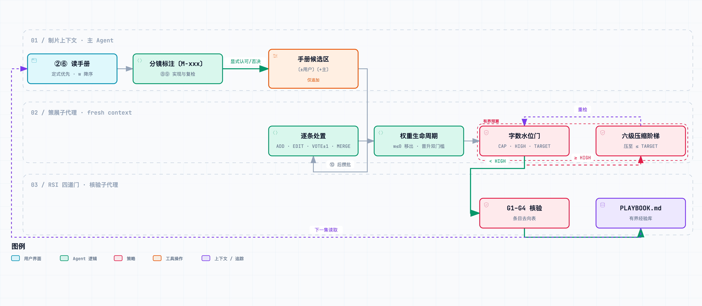

# 动效画面建模经验的有界沉淀：理论、证据与方案比选

> **结论先行**：建模经验以**条目化、带权重、有字数上限**的经验库（[references/MODELING-PLAYBOOK.md](../../references/MODELING-PLAYBOOK.md)）沉淀；制片主 Agent 只往候选区追加信号，策展子代理攒批增量合并；超限时按「失真由小到大」的六级阶梯压缩，**禁止整体重写**。协议正文在 [RSI.md 第十节](../../RSI.md)，规则唯一实现在 [check_playbook.py](../../scripts/check_playbook.py)，本文只存设计依据（台账：[RSI-003](../.agents/issue.md)）。

## 一、问题：为什么需要「有界」

- **经验在蒸发**：被用户认可的建模方法（如 LoopRing「恒定视觉锚」、「以静写闷」）此前只能以散文偶然埋进 [references/08](../../references/08-remotion-implementation.md) 母题表与 [references/09](../../references/09-render-qa.md) 缺陷表，无结构化入口、无认可强度、无淘汰机制。
- **无界即膨胀**：经验逐集回流天然单调增长。references/08 已约 6150 字（全仓最大），继续追加会把新经验埋进中段——长上下文的中段利用率显著下降 [13]、输入越长模型越退化 [12]。
- **全仓无先例**：此前没有任何文档体量执法，本机制是第一个。

## 二、理论：至真 · 至迭代 · 递归

| 理念 | 含义 | 落地机制 |
|---|---|---|
| **至真** | 条目必须能被证伪，而非「好像有用」 | 必填「验」字段（成片帧上可观测的判据）+「证」锚点（集目录名#镜号 + 年月）；只从显式信号入库 |
| **至迭代** | 每次复用都是一次再验证 | 权重生命周期：认可 +1、否决/返工 −1、归零移出 [3]；满 3 票且 ≥2 集才晋升定式（Rule of Three [9]） |
| **递归真意** | 沉淀机制自身也受反馈约束 | 策展走 RSI 四道门；「回潮信号」——被压缩掉的经验再次被需要时恢复原条目，压缩阶梯本身被经验纠偏 |

## 三、回路总览

<picture>
  <source media="(prefers-color-scheme: dark)" srcset="../assets/architecture/modeling-experience--loop-dark.png">
  
</picture>

> 图源：[`modeling-experience--loop.mmd`](../assets/mermaid/modeling-experience--loop.mmd) · 交互版：[`modeling-experience--loop.html`](../assets/architecture/modeling-experience--loop.html)

## 四、证据与借鉴

| 来源 | 关键发现 | 借鉴到本方案 |
|---|---|---|
| ACE [1] | 条目化 bullet + helpful/harmful 计数 + 增量 delta 合并优于整体重写；整体重写使 AppWorld 上下文从 18,282 坍缩至 122 tokens，准确率 66.7→57.1，跌破无适应基线 63.7 | 条目化单行格式；**禁止整文件重写**；Generator / Reflector / Curator 分权 |
| Dynamic Cheatsheet [2] | 带字数上限与使用计数的 cheatsheet 可显著提升；整体再生成会截断失真 | 硬上限 + 权重计数；只做增量改 |
| ExpeL [3] | ADD / EDIT / UPVOTE / DOWNVOTE；新洞见初值 2，赞 +1、踩 −1，归零淘汰 | 权重生命周期原样借用（w 初值 2、归零移出） |
| Xiong et al. [4] | 智能体会照抄相似记忆的输出，存储的错误经验会传播放大 | 只收显式信号；主 Agent 自评为弱信号（w=1），不能单独晋升 |
| DGM [5] / SICA [6] | 自改进须有外部评估；基准偏离真实目标时回路会放大错位 | 晋升定式须含用户信号；策展走四道门 |
| Anthropic Skill 最佳实践 [7] / 上下文工程 [8] | 进度披露、上下文是共享预算、「最小高信号 token 集」 | 手册不进 SKILL.md 正文，只挂指针；有界 + 高权重置顶 |
| Context Rot [12] / Lost in the Middle [13] | 输入越长越退化；中段位置利用率最低 | 硬上限；节内按 w 非增排列 |
| 模式语言 [10] / Nygard ADR [11] | 「语境 → 因此 → 祈使式方案」；编号只增不复用、被推翻者标注取代 | 「当 / 故 / 非」字段；M-/X- 编号永不复用 |
| CBR [14] / 保能力删除 [15] | 检索—复用—修订—保留循环；删案例须先删被包含者，唯一覆盖者最后动 | 压缩阶梯第 5 级「冷退」只动非唯一覆盖条目 |
| Linux 水位 [16] / Elasticsearch 磁盘水位 [17] | 高低水位滞回防抖，触发线与目标线分离 | HIGH 触发、压至 TARGET，一次压缩换数集余量 |
| Tversky et al. [18] / Mayer & Fiorella [19] | 一致性（图形结构对应概念结构）与可感知性；信号提示过度即失效 | 条目「据」字段的原则标签（一致性、信号克制） |

## 五、方案比选（G2）

| 决策点 | 候选 | 评选 | 理由 |
|---|---|---|---|
| 经验落点 | ① 追加进 references/08 正文 ② 独立有界手册 ③ issue.md 台账复用 | **②** | ① 正是膨胀源；③ 混淆「机制缺陷」与「内容经验」的分流边界；② 与 [PRON-GLOSSARY](../../references/PRON-GLOSSARY.md) 同构（跨集沉淀台账先例），且不能放进 `references/NN-*.md` 阶段规格序列（速查表一阶段一行执法） |
| 候选暂存 | ① 手册内候选区 ② 分集 `$P/script/` ③ issue.md | **①**（用户确认） | 候选计入预算，预算压力天然逼迫及时策展；代价是 RSI 只读例外由一处扩为两处（均为仅追加） |
| 字数上限 | 2000 / **3000** / 5000 | **3000**（用户确认） | 与 SKILL.md（约 2120）同量级，约容 30 条；5000 逼近 references/08 体量，context rot 风险上升；2000 早期即频繁压缩 |
| 水位 | 单阈值 / **滞回双阈值** | 滞回 | 单阈值会在每次追加时抖动；HIGH−TARGET = 450 字约容 4–5 条新条目 |
| 计数口径 | 字符数 / tokens / **汉字 + 英文词** | 汉字 + 英文词 | 字符数被标点与英文字母虚高；tokens 依赖分词器不确定；本口径同 UAX #29 对表意字逐字断词的语义 [20]，确定且中英公平；链接目标不计，鼓励指针而非复制 |
| 压缩执行者 | 脚本自动 / **LLM 子代理 + 门** | 子代理 + 门 | 语义合并与归纳需要判断；机器只负责判超限与结构合规，避免「自动删除」误伤唯一覆盖条目 |
| 迁移范围 | 只播种 / **轻迁移** / 全量迁移 | 轻迁移（用户确认） | 只迁 references/08「LoopRing 适用列」与「以静写闷」两处改指针；3D 宪法与读色契约属规格契约（不是经验），留在 08 |

## 六、撤销条件与已知局限

- **撤销条件**：连续 3 集手册零引用（分镜无〔M-xxx〕标注、候选区无追加）⇒ 机制降级为「手册只读、停止策展」，台账记录死因。
- **局限一**：「含 ≥1 次用户信号」这一晋升条件门不可见（候选区策展后清空），只能由核验子代理人工核对 PR 中的条目去向表。
- **局限二**：计数器不识别语义冗余——两条措辞不同但同键的条目只能靠策展子代理在阶梯第 2 级合并。
- **局限三**：播种的 4 条均来自同一集（claude-code-explained-video），尚无跨集证据，故全部为试行。

## 参考文献

[1] Q. Zhang et al., "Agentic context engineering: Evolving contexts for self-improving language models," in *Proc. ICLR*, 2026. [Online]. Available: https://arxiv.org/abs/2510.04618

[2] M. Suzgun, M. Yuksekgonul, F. Bianchi, D. Jurafsky, and J. Zou, "Dynamic Cheatsheet: Test-time learning with adaptive memory," arXiv:2504.07952, 2025. [Online]. Available: https://arxiv.org/abs/2504.07952

[3] A. Zhao, D. Huang, Q. Xu, M. Lin, Y.-J. Liu, and G. Huang, "ExpeL: LLM agents are experiential learners," in *Proc. AAAI*, vol. 38, 2024. [Online]. Available: https://arxiv.org/abs/2308.10144

[4] Z. Xiong et al., "How memory management impacts LLM agents: An empirical study of experience-following behavior," arXiv:2505.16067, 2025. [Online]. Available: https://arxiv.org/abs/2505.16067

[5] J. Zhang, S. Hu, C. Lu, R. Lange, and J. Clune, "Darwin Gödel Machine: Open-ended evolution of self-improving agents," arXiv:2505.22954, 2025. [Online]. Available: https://arxiv.org/abs/2505.22954

[6] M. Robeyns, M. Szummer, and L. Aitchison, "A self-improving coding agent," arXiv:2504.15228, 2025. [Online]. Available: https://arxiv.org/abs/2504.15228

[7] Anthropic, "Skill authoring best practices," Claude Docs. [Online]. Available: https://platform.claude.com/docs/en/agents-and-tools/agent-skills/best-practices

[8] P. Rajasekaran, E. Dixon, C. Ryan, and J. Hadfield, "Effective context engineering for AI agents," Anthropic Engineering, Sep. 2025. [Online]. Available: https://www.anthropic.com/engineering/effective-context-engineering-for-ai-agents

[9] M. Fowler, *Refactoring: Improving the Design of Existing Code*. Reading, MA, USA: Addison-Wesley, 1999.

[10] M. Fowler, "Writing software patterns," 2006. [Online]. Available: https://www.martinfowler.com/articles/writingPatterns.html

[11] M. Nygard, "Documenting architecture decisions," Cognitect, Nov. 2011. [Online]. Available: https://cognitect.com/blog/2011/11/15/documenting-architecture-decisions

[12] K. Hong, A. Troynikov, and J. Huber, "Context rot: How increasing input tokens impacts LLM performance," Chroma, Tech. Rep., Jul. 2025. [Online]. Available: https://www.trychroma.com/research/context-rot

[13] N. F. Liu et al., "Lost in the middle: How language models use long contexts," *Trans. Assoc. Comput. Linguistics*, vol. 12, pp. 157–173, 2024. [Online]. Available: https://aclanthology.org/2024.tacl-1.9/

[14] A. Aamodt and E. Plaza, "Case-based reasoning: Foundational issues, methodological variations, and system approaches," *AI Commun.*, vol. 7, no. 1, pp. 39–59, 1994, doi: 10.3233/AIC-1994-7104.

[15] B. Smyth and M. T. Keane, "Remembering to forget: A competence-preserving case deletion policy for case-based reasoning systems," in *Proc. 14th IJCAI*, 1995, pp. 377–382.

[16] The Linux Kernel Documentation, "Memory balancing." [Online]. Available: https://docs.kernel.org/mm/balance.html

[17] Elastic, "Fix watermark errors," Elasticsearch Docs. [Online]. Available: https://www.elastic.co/docs/troubleshoot/elasticsearch/fix-watermark-errors

[18] B. Tversky, J. B. Morrison, and M. Bétrancourt, "Animation: Can it facilitate?" *Int. J. Hum.-Comput. Stud.*, vol. 57, no. 4, pp. 247–262, 2002, doi: 10.1006/ijhc.2002.1017.

[19] R. E. Mayer and L. Fiorella, "Principles for reducing extraneous processing in multimedia learning," in *The Cambridge Handbook of Multimedia Learning*, 2nd ed. Cambridge, U.K.: Cambridge Univ. Press, 2014, pp. 279–315.

[20] Unicode Consortium, "UAX #29: Unicode text segmentation." [Online]. Available: https://www.unicode.org/reports/tr29/
