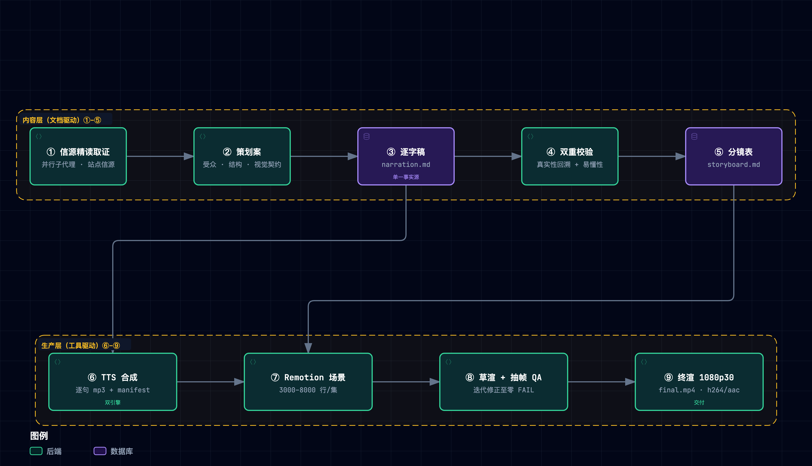

# 科普视频制作 Pipeline（公共基建）

> 从「论文精读 → 逐字稿 → 配音 → 代码动画 → 终渲」全链路中沉淀的**可复用流水线机制**：抽取自 negentropy 仓，以 to-video 技能仓为家，安装在任意内容工作区上使用。
> 首个建成的完整范例：《AI 如何自己变强？》（`$W/episodes/self-improving-agents-video/`；建成时间上的第一个，非系列首集，发布顺序见 `$W/series.json`）。

**目录**：一、Pipeline 总览 · 路径变量约定（含环境变量） · 二、工程目录约定 · 三、公共脚本与编排入口（含 pipeline.toml 字段表、交付归档） · 四、复用边界 · 五、音画同步机制（含双语渲染） · 六、新集脚手架清单 · 七、工程模式 · 八、许可注意

## 一、Pipeline 总览（9 Stages）



> 图源（可 diff 文本）：[`pipeline-layers.mmd`](../docs/assets/mermaid/pipeline-layers.mmd) · 交互版（下载到本地打开）：[`pipeline-layers.html`](../docs/assets/architecture/pipeline-layers.html)

每个 Stage 的代理提示词规格见本目录的 `01`–`09` 九篇规格（[01](./01-source-extraction.md) 起），可直接作为子代理 prompt；整仓即 to-video 技能本体，路由入口是 [SKILL.md](../SKILL.md)（skill 根）。

**九阶段的声明源是 [stages.toml](./stages.toml)**（上图与下表都是它的人读视图）。执行 `uv run --no-project $T/scripts/pipeline.py stages` 打印全表。此前「有哪九个阶段」同时声明在四处（skills 散文标题 / `pipeline.py` 子命令 / 上面的 mermaid / [SKILL.md](../SKILL.md)（skill 根）速查表），四份可各自漂移且**已经漂移**。序号与文件号一一对齐（⑥=`06-tts-voice.md`、⑦=`07-remotion-implementation.md`；历史上的错位已随 RSI-009 废除），由 [tests/test_stages.py](../tests/test_stages.py) 连同 skill H1、子命令注册表、SKILL.md 覆盖面一起执法。

## 路径变量约定

本文档、九篇阶段规格与各分集 README 中的**命令**统一用下面四个变量书写，使命令与两个位置事实解耦——skill 装在哪、工作区放在哪（换安装位置 / 搬工作区 / 多工作区并存零改动）；**散文里的链接保持 skill 内部的真实相对路径**：跨树引用（工作区里的文件）做不成相对链接，一律以变量写成纯文本，链接变量化则会造出任何机器都解不开的死链：

```bash
T=~/.claude/skills/to-video   # skill 根（机制的家 = 本仓；env TO_VIDEO_HOME 或任意 clone + 软链皆可）
W=<内容工作区根>              # 含 .to-video-root 哨兵的目录（env TO_VIDEO_WORKSPACE 显式指派）
P=$W/episodes/<slug>-video    # 目标分集工程（各集 README 里换成本集 slug）
V=$W/voices                   # 音色样本目录（整目录 gitignored，生物特征）
```

**$T 与 $W 物理分离**（机制住技能仓、内容住工作区），一条命令同时引用两者是常态（如 `$T/scripts/qa_frames.py $P/out/draft.mp4`）。skill 脚本定位工作区走「env `TO_VIDEO_WORKSPACE` > 自 CWD 向上找哨兵」，找不到即大声退出——故 $T 锚定的命令仍须**在工作区内（或其子目录）执行**。⚠️ 混锚禁令（反向）：$T 锚定的命令里不得出现工作区相对字面量（`voices/…`、`episodes/…`）——`pipeline.toml` 的 `tts.ref` 与 `series.json` 的 `path` 是**工作区根相对**（配置契约而非命令，由 `paths.WORKSPACE` 拼接），把那套写法搬进命令行会造出（skill 侧 tts_sample 配「裸 voices/ 前缀」样本参数）这类**在任何 CWD 下都不成立**的混锚命令——命令行里的样本路径一律走 `$V`。该纪律由 [tests/test_docs_paths.py](../tests/test_docs_paths.py) 执法。

### 环境变量（机器属性注册处）

机器属性（随主机而变的路径与服务地址）只走 env，**永不写进受版本控制的 toml**；新增此类 env 须在本表登记（消费者注释指向此处）。

| env | 作用 | 缺省 |
|---|---|---|
| `TO_VIDEO_HOME` | skill 根（包装器解析首位；其后依次 `~/.claude/skills/to-video` → `~/.agents/skills/to-video`，未命中即大声退出） | 无（靠软链命中） |
| `TO_VIDEO_WORKSPACE` | 工作区根显式指派（目录须含哨兵，防拼错静默锚错；工作区级包装器会用自身位置硬性覆写它） | 自 CWD 向上搜索哨兵 |
| `TO_VIDEO_TTS_STORE` | TTS 音频版本库根 | `~/Library/Application Support/to-video/tts-store` |
| `TO_VIDEO_INDEX_TTS_ROOT` | IndexTTS 服务仓（`tts_server` / `tts_bench` 的运行环境） | `~/tools/index-tts` |
| `INDEXTTS_SERVER` | IndexTTS 服务地址，覆盖 `pipeline.toml` 的 `tts.server`（见下方字段表） | 无（回落 `tts.server` 缺省 `http://127.0.0.1:8766`） |
| `TO_VIDEO_DELIVER_ROOT` | 交付归档根路径（`deliver` 子命令；`--root` 一次性优先于此） | 无（未配置时 deliver 大声退出并列两渠道） |
| `TO_VIDEO_TEST_WORKSPACE` | 测试集成模式：指向真实内容工作区做真树回归 | 无（单测用 fixture） |

## 二、工程目录约定

先看 **skill 根** `$T/`（本仓，按 [Agent Skills 规范](https://agentskills.io/specification)布局）：

```
$T/
├── SKILL.md           # 路由壳（skill 根哨兵：脚本自 __file__ 向上找它）
├── references/        # 九篇阶段规格 01–09、本文件、stages.toml、手册
├── scripts/           # Python 工具链（全部实现的唯一住处）
├── assets/            # video-skeleton / workspace 模板、quickstart 示例场景
├── tests/             # pytest（运行命令见 pyproject.toml 顶部注释）
├── evals/             # 输出质量与触发评测集
```

再看**工作区根** `$W/`（`scaffold.py --init-workspace` 落盘的骨架，也是机制与内容的物理分界线）：

```
$W/
├── .to-video-root     # 工作区哨兵（skill 脚本自 CWD 向上定位工作区靠它，勿删）
├── series.json        # 发布顺序 SSOT（机读，顶层 seriesList[]）
├── series.md          # 作品总览（人读）
├── source-map/        # 多集系列的章节→集归属信源地图
├── voices/            # 参考音色样本（gitignored 生物特征；refs.toml 只存指纹）= $V
├── to-video.toml      # 工作区机制配置（check_series 工程级受检面与系列 id 集、骨架合法偏离登记）
├── scripts/*.py       # 工作区级薄包装 → skill（自证工作区锚并硬性覆写 TO_VIDEO_WORKSPACE）
└── episodes/          # 每集一个 <slug>-video 工程（下）
```

每集视频一个 `$P/` 工程：

```
$P/
├── README.md               # 本集说明（目录表/复现流水线/视觉契约/许可）
├── research/paper-notes.md # 事实源：全部口播断言须可回溯至此
├── script/
│   ├── planning.md         # 策划案
│   ├── narration.md        # 逐字稿（唯一维护处，勿改 narration.json）
│   ├── narration.json      # 派生物（build_narration.py 生成）
│   ├── narration.cues.toml # 配音台本（可选，story 档：块边界/块情绪/表演标点；写稿阶段同产）
│   ├── storyboard.md       # 分镜表（镜号↔句 id 区间↔画面↔动效）
│   └── narration.en.md …   # 双语集才有：英文对齐译稿 + narration.en.json + 基线锁（见 §五「双语渲染」）
├── scripts/*.py            # 薄包装 → skill 解析器（保 CLI 契约）
├── video/                  # Remotion 独立 pnpm 工程（自带 pnpm-workspace.yaml，钉为独立 workspace 根）
└── out/                    # 渲染产物（gitignored）
```

两级薄包装都不含实现：skill 位置由 `TO_VIDEO_HOME` → `~/.claude/skills/to-video` → `~/.agents/skills/to-video` 依序解析（命中 = 候选目录含 `SKILL.md` 且有 `scripts/pipeline.py`；工作区根也有 `scripts/pipeline.py`，缺哨兵判据则 `TO_VIDEO_HOME` 误指工作区时包装器自递归），未命中即大声退出并打印安装指令——静默跳过是被禁止的失效形态。

**格式契约**（`build_narration.py` 的解析规则）：
- narration.md：`## P0 标题` 分幕 + `- [p0-01] 文本` 一句一行；句 id 必须以幕名小写为前缀、全片唯一。
  幕标题另派生 `video/src/chapters.json`（顶部分段章节进度条的标签数据面）。
- `>` 引用块为画面备注，不进配音；英文方法名做角标不口播。

## 三、公共脚本（单一事实源）与编排入口

**单入口 `pipeline.py`**（参数读各集 `pipeline.toml`；阶段契约见下表）：

```
uv run --no-project $T/scripts/pipeline.py --project $P     {status|doctor|build|check|tts|captions|deliver|render|qa|all|clean-samples|stages}
```

> `clean-samples` 与 `stages` 与具体工程无关，不读 `pipeline.toml`（`--project` 可省）。
> 本清单与 `pipeline.py` 文件头的抄件由 [tests/test_stages.py](../tests/test_stages.py) 对齐 argparse 真实注册表。
> 工作区内亦可走薄包装：`uv run --no-project $W/scripts/pipeline.py --project $P …`（包装器自证工作区锚并硬性覆写 `TO_VIDEO_WORKSPACE`，从任意 CWD 调用都锚定本工作区）。

| Stage | 命令             | 输入 → 产出                                         | 幂等/续跑               |
| ----- | ---------------- | --------------------------------------------------- | ----------------------- |
| ③     | `build`          | narration.md → narration.json + video/src/chapters.json | 纯函数               |
| ④⑤    | `check`          | narration.json + storyboard.md + pipeline.toml → 门 | —                       |
| ⑥     | `tts [--plan]`   | narration.json + 参考样本 → 逐句 mp3 + manifest     | sidecar 摘要 / 逐句续跑 |
| ⑥+    | `captions`       | manifest + timing.json → out/captions.{srt,vtt}     | 纯函数                  |
| ⑧     | `render` + `qa`  | src + audio → draft.mp4 + 抽帧体检                  | 渲染否 / 抽帧是         |
| ⑨     | `render --final` + `deliver` | 同上 → final.mp4 + 归档副本（前置：⑧ 零 FAIL）  | 否                      |

`status` 为派生式新鲜度表（无状态文件——幂等已由内容摘要提供，再存阶段状态即第二事实源）；`doctor` 自检配置/时序 SSOT/样本指纹/IndexTTS 服务。

| 脚本 | 用途 | 工程内等价调用 |
| ---- | ---- | -------------- |
| [scripts/build_narration.py](../scripts/build_narration.py) | narration.md → narration.json + chapters.json（章节条标签）+ 时长估算 | `uv run --no-project scripts/build_narration.py` |
| [scripts/tts.py](../scripts/tts.py) | 逐句配音合成 + 时长 manifest（幂等，双引擎：edge 预置音色 / indextts 声音克隆；风格推荐位 sunny 明快阳光，`--steady` 混合档让关键句单独升束宽，`--plan` 预演排期） | `uv run --no-project --with edge-tts --with mutagen scripts/tts.py`（克隆模式免 edge-tts，见 [VOICE-CLONING.md](./VOICE-CLONING.md)） |
| [scripts/tts_server.py](../scripts/tts_server.py) | IndexTTS 推理服务（声音克隆后端，**运行于 index-tts 环境**，非本仓） | 在 `~/tools/index-tts` 内启动，见 [VOICE-CLONING.md §二](./VOICE-CLONING.md) |
| [scripts/tts_sample.py](../scripts/tts_sample.py) | 单句声音小样试听（直调 IndexTTS 服务合成一句话 + 全风格 A/B，定稿风格前的必经关口） | 无工程薄包装，从 $T 调用：`uv run --no-project --with mutagen $T/scripts/tts_sample.py --ref <样本.wav> --all-styles --play`，见 [VOICE-CLONING.md §5.1](./VOICE-CLONING.md) |
| [scripts/prepare_ref.py](../scripts/prepare_ref.py) | 参考音色样本裁剪/规范化（长录音 → **10–14s** 干净 WAV；硬上限 15s——上游超出即静默前截） | 无工程薄包装（与具体工程无关），从 $T 调用：`uv run --no-project --with soundfile --with numpy $T/scripts/prepare_ref.py <源音频>` |
| [scripts/prospect_ref.py](../scripts/prospect_ref.py) | 参考样本选段勘探（按 F0/起伏/音节率/限带质心筛「更亮更轻快」的候选起点）+ `--accept` **保真度验收**（削波/底噪/动态/有效带宽/超 15s，与风格分正交；损伤事后无法弥补故只否决不加权） | 无工程薄包装，从 $T 调用：`uv run --no-project --with soundfile --with numpy $T/scripts/prospect_ref.py <源音频…>`，见 [VOICE-CLONING.md §3.2](./VOICE-CLONING.md) |
| [scripts/pipeline.py](../scripts/pipeline.py) | **单入口编排**（上表） | `uv run --no-project $T/scripts/pipeline.py --project $P tts --plan` |
| [scripts/timeline.py](../scripts/timeline.py) | 时间轴 Python 侧实现（与 timing.ts 同构，直读 timing.json） | 被 qa_frames/captions/check_script 复用 |
| [scripts/check_script.py](../scripts/check_script.py) | ④⑤ 内容门：beat 覆盖性 / 时长预算双口径 / SceneFade 不变式 / 画面文字复述口播（缺省 FAIL）/ `--check-scenes` 分镜↔代码互比 | `uv run --no-project scripts/check_script.py --check-scenes` |
| [scripts/archify_lead.py](../scripts/archify_lead.py) | 场记板白闪**实测**回写各章真实 `lead_sec`（录制器恒写 0.0，漏跑＝白闪帧播进成片——全 0 由覆盖门点名 WARN）；webm 前段含页面加载非故事起点、墙钟估算带 ±0.3s，故只在像素上找白闪末帧 | `uv run --no-project --with pillow $T/scripts/archify_lead.py --project $P` |
| [scripts/archify_manifest.py](../scripts/archify_manifest.py) | sidecar JSON → `video/src/archify.manifest.ts`（静态导入让章节 id 拼错在 `tsc` 就红，不等渲染才发现）；录制或重测 lead 后重跑 | `uv run --no-project $T/scripts/archify_manifest.py --project $P` |
| [scripts/check_archify.py](../scripts/check_archify.py) | archify 回放**结构**门（只查结构不查画面语义——图层遮挡/时序错位须 `remotion still` 逐帧目视）：manifest × views 一致 / rate 预演边界 `[0.7, 1.35]`（阈值走 config）/ 素材完整（逐章有效采集帧率 ≥18，`capture_fps` 优先）/ 白录检测（manifest 有图却零 cue 引用）；`--stills` 打印每个 cue 的 K1/K4 边界帧抽帧命令 | `uv run --no-project $T/scripts/check_archify.py --project $P` |
| [scripts/check_archify_coverage.py](../scripts/check_archify_coverage.py) | archify 覆盖门（`check` 子命令在内容门后**自动串联**，无 flag）：图例对逐字稿的句级锚定率（整幕零锚 FAIL）/ 图与 cue 丰富度地板 / 分镜声明↔cue 双向对账 + 章节播放单调性；无资产集干净跳过，旧形态（仅 sidecar）点名 WARN 跳过 | `uv run --no-project $T/scripts/check_archify_coverage.py --project $P` |
| [scripts/check_playbook.py](../scripts/check_playbook.py) | 建模手册有界门（RSI 建模经验分支）：字数水位（CAP/HIGH/TARGET 滞回）+ 条目结构/权重/证锚点规则的唯一实现；零依赖、不需工作区 | `uv run --no-project $T/scripts/check_playbook.py` |
| [scripts/check_series.py](../scripts/check_series.py) | 系列一致性规则（口播反串线 / 多标题顺序 / 序号绑定 / 清单完整性 / 死链 / 可渲染性 / 去站点化 / 下期卡同步），执法 `$W/series.json`；**工程级受检面（project_globs）与课程/下期卡系列 id 集由工作区 to-video.toml 声明** | 工作区内任意目录：`uv run --no-project $T/scripts/check_series.py`（工作区侧可挂 pre-commit） |
| [scripts/captions.py](../scripts/captions.py) | 导出 srt/vtt（cue 终点不含句间停顿——外挂字幕静默期不留字） | `uv run --no-project scripts/captions.py` |
| [scripts/deliver.py](../scripts/deliver.py) | ⑨ 交付归档：out/final.mp4 → `<根>/<系列id>/<集标题> vN.mp4`（版本扫目录自增、同字节跳过；根路径两渠道见下方「交付归档」节） | `uv run --no-project $T/scripts/pipeline.py --project $P deliver` |
| [scripts/qa_frames.py](../scripts/qa_frames.py) | 抽帧 QA（幕/句/`--last-n` 末 N 句）+ `--check` 四项自动体检 + `--check-theme` WCAG 对比度 | `uv run --no-project --with pillow --with numpy scripts/qa_frames.py out/draft.mp4 --last-n 6 --check`（工程根；视频路径按 CWD 解析，$T 直调须写全 `$P/out/draft.mp4`） |
| [scripts/paper_extract.py](../scripts/paper_extract.py) | Stage ① 取证工具箱（§→页映射 / 分栏取文 / caption 收割 / 定点 find / 页面光栅化） | `uv run --no-project --with pymupdf $T/scripts/paper_extract.py "<PDF>" find "原文措辞"` |
| [scripts/refs.py](../scripts/refs.py) | 参考样本可复现清单（verify/rebuild；指纹在 `$W/voices/refs.toml`——工作区内容，只存哈希不存音频） | `uv run --no-project $T/scripts/refs.py verify` |
| [scripts/source_ledger.py](../scripts/source_ledger.py) | Stage ① **B 型信源**可复现清单（fetch/list/verify + sync/audit——后两者消费系列级 `$W/source-map/` 地图，幂等批量建台账 + 离线三断言；`repo` 类固定提交 raw 指纹漂移即 FAIL，`site` 类只比归一正文、漂移报 WARN） | `uv run --no-project $T/scripts/source_ledger.py --project $P verify`；`sync --map <map.toml> --episode N` / `audit --map <map.toml> --episode N` |
| [scripts/pron_marks.py](../scripts/pron_marks.py) | 发音标注 `<原文\|读音>` 的解析与校验（纯函数库，无 IO）：多音字/英文专名的精确读音控制；被 `build_narration.py` 用于硬失败拦非法标注 | 库，不直接调用；语法与规则见其模块文档，台账见 [PRON-GLOSSARY.md](./PRON-GLOSSARY.md) |
| [scripts/tts_progress.py](../scripts/tts_progress.py) | IndexTTS 长跑**旁路**监视：按逐句 mp3 的 mtime 序列重建墙钟进度 + 滚动秒/字 vs 基线（与合成进程零耦合、退出码恒 0——监视器不打断长跑；越阈先分因：负载竞争可继续只重排期，热节流才须中止验证环境） | 长跑期间另开终端：`uv run --no-project $T/scripts/tts_progress.py --project $P` |
| [scripts/tts_bench.py](../scripts/tts_bench.py) | 合成耗时基准与**测量环境体检**（**运行于 index-tts 环境**，同 tts_server.py）：A/A 复现性判定 + 分段计时 + 换页/分配器诊断。本机漂移已定因为热节流，做任何耗时 A/B 前先用它确认环境合格 | 在 `~/tools/index-tts` 内：`./.venv/bin/python $T/scripts/tts_bench.py --check-only`；A/A 见 [INDEXTTS-2.5-ADVANCED.md §6.5](./INDEXTTS-2.5-ADVANCED.md) |

中心脚本以 `--project <工程根>` 参数化；工程内 `scripts/*.py` 与工作区 `scripts/*.py` 为薄包装（透传参数、保持原 CLI）。改造/迭代只改 `$T/scripts/`，验证门 = 受影响工程的 `narration.json` / `manifest.json` 字节级不变。

### pipeline.toml 字段表

schema、默认值与校验的单一事实源是 [scripts/config.py](../scripts/config.py) 的 `SCHEMA`（此前 schema 只是「两个脚本里 `.get()` 调用的并集」，无处可查、键名 typo 静默生效）。**默认值在代码、toml 只写偏离**——判据是「删机制常数、留策略声明」。跑 `pipeline.py doctor` 打印带来源标注（`pipeline.toml` / `default` / `env:*`）的生效配置表。

| 键                              | 必填            | 默认                    | 性质                                                                                                                           |
| ------------------------------- | --------------- | ----------------------- | ------------------------------------------------------------------------------------------------------------------------------ |
| `episode.slug`                  | ✅               | —                       | 须等于工程目录名（拦手抄来的陈旧 toml）；**是否登记进 series.json 不在此校验**，那归 `verify_skeleton.py` 的孤儿警告（非阻塞） |
| `narration.target_minutes`      | ✅               | —                       | `[下限, 上限]` 分钟；缺失会让时长预算门**点名跳过**                                                                            |
| `narration.chars_per_min`       |                 | `280`                   | 机制常数                                                                                                                       |
| `tts.engine`                    |                 | `indextts`              | **策略声明**（有替代项 edge，且受 `.engine` 签名护栏约束），故保留在 toml                                                      |
| `tts.ref`                       | engine=indextts | —                       | **工作区根相对**（如 `voices/me-bright.wav`）；内容入缓存摘要（改拼法不失效缓存）                                             |
| `tts.ref_sha1`                  | engine=indextts | —                       | 12 位，同 tts.py 口径                                                                                                          |
| `tts.style`                     | engine=indextts | —                       | STYLE_PRESETS 档名（新集缺省 story＝段落演绎，见 VOICE-CLONING §4.5）                                                          |
| `tts.lang`                      |                 | `ZH`                    | 机制常数（zh 主稿恒 ZH；en 版由语言自动解析为 EN，见 §五「双语渲染」）                                                          |
| `narration.langs`               |                 | `["zh"]`                | **策略声明**：本集产出的语言版本（必含 zh）；en 需显式声明并配 `narration.en.md`                                               |
| `narration.words_per_min`       |                 | `150`                  | 机制常数：英文含停顿等效语速（首集实测后校准）                                                                                  |
| `narration.en`                  |                 | `{}`                   | 英文覆写表，允许 `target_minutes`（缺省 ⇒ 英文预算门点名跳过，不继承 zh 窗口）                                                 |
| `tts.en`                         |                 | `{}`                   | 英文配音覆写表，允许 `engine/ref/ref_sha1/style/voice`，其余继承 `[tts]`                                                       |
| `tts.server`                    |                 | `http://127.0.0.1:8766` | **机器属性**：可用 `INDEXTTS_SERVER` 覆盖，永不写进 toml                                                                       |
| `render.draft_scale`            |                 | `0.5`                   | 机制常数（`qa --scale` 推断依赖它）                                                                                            |
| `render.draft_jpeg_quality`     |                 | `60`                    | 机制常数                                                                                                                       |
| `archify.min_diagrams`          |                 | `1`                     | 丰富度地板：views 图数下限；目标值由本集 toml 覆写（策略声明）                                                                 |
| `archify.min_cues`              |                 | `2`                     | cue 总数下限；同上                                                                                                             |
| `archify.min_anchor_ratio`      |                 | `0.10`                  | 句级锚定率下限 ∈ [0,1]（ISSUE-188：按句统计）                                                                                  |
| `archify.min_chapter_ratio`     |                 | `0.30`                  | 被 cue 引用章 / 总章 下限                                                                                                      |
| `archify.per_scene_min_anchors` |                 | `1`                     | 每幕最少锚句数（整幕零锚 FAIL）                                                                                                |
| `archify.exempt_scenes`         |                 | `[]`                    | 豁免零锚判定的幕名（如 `["P6"]`）；豁免在覆盖门输出里点名                                                                      |
| `archify.rate_min`              |                 | `0.7`                   | 机制常数（check_archify rate 预演带下界，与 Remotion 侧 `pickFit` 自动降档契约同构）                                            |
| `archify.rate_max`              |                 | `1.35`                  | 机制常数（rate 预演带上界；同上）                                                                                               |
| `archify.min_fps`               |                 | `18.0`                  | 机制常数（素材完整门：录制均帧率低于此值 WARN 建议重录）                                                                        |
| `archify.html_dir`              |                 | `archify-html`          | 重录源图目录（**PROJECT 根相对** = 工作区所在 git 仓库根；`/archify` 等出图工具的产物落点，`record_archify_all.py` 的 slug→源图映射基准） |

未知键报 WARN 并给最近邻建议（保留前向兼容）；类型/取值域/必填/slug 不符报 FAIL。`status` 与 `doctor` 只报不退——诊断工具因被诊断对象有病而拒绝运行是荒谬的；其余子命令 FAIL 即退出。

**默认值只许有一份**：消费者脚本需要兜底时一律写 `config.default("<节>.<键>")`，不得内联字面量。`config.load(required=False)` 在缺 `pipeline.toml` 时直接返回 `{}`（不走 `resolve()`），所以内联的 `.get(k, 280)` 是**可达**的第二事实源——改 SCHEMA 时那条路径会静默沿用旧口径。该纪律由 [tests/test_config.py](../tests/test_config.py) 执法。

### 交付归档（deliver 子命令）

终渲产物 `out/final.mp4` 是 gitignored 的**新鲜渲槽位**（每次重渲直接覆盖）；`deliver` 把成片复制进跨集统一归档根，按 `<根>/<系列 id>/<集标题> v<N>.mp4` 管理——系列 id 与集标题的唯一事实源是 `$W/series.json`（发布顺序 SSOT，此处不新增配置副本），版本号 N 实时扫描目标目录取既有最大号 +1（零状态文件，目录内容即事实源；不回填洞）。同字节重投自动跳过不升版；`.part` 原子落位；绝不覆写既有版本（大小写不敏感文件系统兜底，判据见脚本头）。

```bash
uv run --no-project $T/scripts/pipeline.py --project $P deliver [--root ~/Documents/video] [--dry-run]
```

- **根路径两渠道**（解析序：`--root` 一次性/prompt 指定 > env `TO_VIDEO_DELIVER_ROOT` 持久统一配置）：机器属性，**永不写进受版本控制的 toml**——同 `tts.server` / tts-store 立场（执法：[tests/test_config.py](../tests/test_config.py) 的 machine-property 用例）。相对路径锚 `$W`（绝不锚 CWD）；两渠道皆无则大声退出并列出用法。双语集 en 版：`deliver --lang en` 归档 `<集标题> vN.en.mp4`，版本扫描按语言独立（fullmatch 后缀隔离，与 zh 互不抬号）。
- **触发形态**：显式子命令，**刻意不串联进 `render --final`**——编排层完成行 `>> render 完成` 是 [references/09](./09-final-render.md) 钉死的判完成信号，串联外部写操作会在失败时产生「标记已打 + 退出码非零」的混合信号；与 `captions` 同为 ⑨ 的显式交付命令。用户在 prompt 给出目标路径时，agent 在终渲成功后显式执行 `deliver --root <路径>`（契约见 references/09 §交付归档）。
- **扇出**：deliver 不在 `--series` 白名单——写用户目录且累积版本文件的交付操作须显式逐集执行。

## 四、复用边界（显式权衡）

- **Python 脚本：集中共享（SSOT）**——共享载体是 skill 仓（`$T/scripts/`），机制工具跨集零差异，中心化防 split-brain；工作区与分集工程只持薄包装（复制「转发」而非「实现」）。
- **Remotion 工程原语：复制适配，不做共享包**——`timing.ts` / `Subtitle` / `cards.tsx` / `theme.ts` 等每集复制后按本集视觉契约修改。理由：每集工程须保持 pnpm **独立可渲染**（嵌套 workspace 自锚隔离 + Remotion 版本自由），共享 TS 包会把「一集的视觉改动」泄漏进其他集。**复制源头是 [assets/video-skeleton/](../assets/video-skeleton/)**（随 skill 分发于 $T，不随内容工作区；frozen 文件清单以 skeleton.toml 为准，勿在文档里维护数字），新集用 `scaffold.py` 实例化、「改任何一处须同步」由 `verify_skeleton.py` 机器执法——此前「以任一既有集为模板」的说法等于给 391 行冻结基建 4 个同权真理声明者，且纸面义务从未被执行过（详见 skeleton.toml 内注）。同类做法：`go mod vendor` + `go mod verify`（物理副本 + 校验门）、Copier（模板 + 应答记录）。
- **每集视觉契约独立设计**（色彩语义映射到本集核心概念），但底层规范复用：深色底 `#0E1116` 系、警示红 `#FF5C5C`、确认绿 `#7ED321`、金句卡衬线体、公式只作角标彩蛋。
- **运动层（`video/src/motion/`，frozen）：共享的是「怎么动」，不是「画什么」**——时长/缓动/弹簧/错峰/巡游等时序语汇跨集一致（同一只手感），theme/motifs/场景构图仍各集自由。2026-09 重制 EP1 时引入：令牌（Carbon 六档时长 + M3 缓动 + 实测弹簧手感）+ 窗口/编排纯函数 + 12 个运动模型 hooks + MotionGallery 评审面，规格与铁律见 [references/07 运动层](./07-remotion-implementation.md)。不读 theme token（两系列概念色名已分叉）是其可 frozen 的前提，由 tests/test_skeleton.py 执法。

## 五、音画同步机制（零手工对轨）

每句一段 MP3；`tts.py` 产出 `video/public/audio/manifest.json`（含每句实测时长）；Remotion `calculateMetadata` 读取 manifest 计算全片时间轴。**改稿后只需重跑：build → tts → render**。引擎可选 edge 预置音色或用自己的声音克隆（[VOICE-CLONING.md](./VOICE-CLONING.md)），两种引擎的 manifest 契约完全一致。

**时序常数单一事实源** = 每集 `video/src/timing.json`（句间/幕间/片头/片尾/幕间淡入淡出）：`timing.ts` 经 `resolveJsonModule` 同步 import，Python 侧（qa_frames/captions/check_script）经 `timeline.py` 直读同一文件——改节奏只动 JSON，双语言镜像漂移结构性不存在。**渲染主机约束**：三集未内嵌 CJK 字体（PingFang SC/Songti SC/SF Mono 系统栈），渲染仅限 macOS；两个重启触发器见 [references/07 事实条](./07-remotion-implementation.md)。

### 双语渲染（zh 主稿 + en 对齐译稿，可选）

「语言」是与九阶段正交的维度，分三层（RSI-004；逐字稿对齐与译写规约见 [references/03](./03-narration.md)，画面文案 i18n 见 [references/07](./07-remotion-implementation.md)，配音决策见 [references/06](./06-tts-voice.md)）：

| 层 | 载体 | 职责 |
| --- | --- | --- |
| 机制 | [scripts/langs.py](../scripts/langs.py) | 语言注册表（tts 码 / edge 音色 / 长度单位）+ 产物路径派生 + `--lang` 解析；tts.py 因导入边界持内联镜像（一致性测试钉住） |
| 策略 | `pipeline.toml` | `narration.langs` 声明本集语言版本；`[narration.en]` / `[tts.en]` 覆写英文偏离项 |
| 执行 | `pipeline.py <cmd> --lang zh\|en\|zh,en\|all` | 本次运行产出哪几版 |

- **路径约定**：主语言 zh 与改造前逐字节一致；en 为 `script/narration.en.{md,json}`、`video/public/audio/en/`（独立 `.engine` 护栏）、`out/captions.en.{srt,vtt}`、`out/{draft,final}.en.mp4`、`out/frames.en/`、交付 `<标题> vN.en.mp4`（版本号按语言独立）。英文时间轴由英文配音实测时长自动重排——分镜 beat 以句 id 取窗，语言无关。
- **对齐与失鲜**：`narration.en.md` 与主稿句 id 1:1（`build --lang en` 硬对齐门）；基线锁 `narration.en.lock.json` 记录翻译时的主稿句 digest，主稿改稿后 `check --lang en` 点名失配句。重建**不自动接受**改过的主稿（gettext fuzzy 语义）：译句改写即视为已重译、自动刷新；译文无需改动时 `build --lang en --accept <ids>` 显式确认。
- **缺省语义（昂贵命令显式化）**：`build` / `check` / `captions` / `status` 缺省跑全部声明语言；**`tts` / `render` / `deliver` / `all` 缺省只跑 zh**（声明多语言而未指定即报错提示 `--lang`），显式多值才顺序执行且完成行按语言分打；`qa` 恒单语言（按视频文件名 `.en` 后缀推断）。
- **骨架分代**：改 frozen 骨架文件引入语言维度属新代（工作区 `to-video.toml` 的 `[[skeleton.generation]]` 登记旧代指纹与花名册，格式见 `skeleton.toml`「骨架分代」节；`verify_skeleton.py` 执法原子性——半同步集报 `GENERATION-MIXED`）；zh 渲染逐像素不变，旧代集重渲时按代整组同步。

## 六、新集脚手架清单

0. （仅全新工作区的第一次）初始化工作区骨架——幂等，逐工件 skip-if-exists（`--force` 才覆盖）：
   ```bash
   uv run --no-project $T/scripts/scaffold.py --init-workspace <dir>
   ```
   落盘哨兵 `.to-video-root`、空 series.json/series.md、voices/ 模板、to-video.toml 与工作区级薄包装。（可选）`export TO_VIDEO_DELIVER_ROOT=<目录>` 持久配置交付归档根——机器属性不进 toml，见 §三「交付归档」。结尾点名的登记系列 / 录样本指纹 / 声明受检面等人工事项是刻意不代做的内容决策。
1. 实例化骨架（替代旧的「`cp -r` 任一既有集」——那句话给 391 行冻结基建留了 4 个同权真理声明者；建集模式自 CWD 锚定 `$W/episodes/`，须在工作区内执行）：
   ```bash
   uv run --no-project $T/scripts/scaffold.py <slug>-video --title "本集标题" \
       --ref <样本名> --ref-sha1 <12位指纹> --style <档名>
   ```
   scaffold 按 skeleton.toml 复制 frozen 文件 + 渲染 4 个模板（package.json / theme.ts / pipeline.toml / README），**刻意不生成 scenes/**（样例留在模板里）、不改 .gitignore（ignore 规则随工作区模板落盘、已通配到分集级）、不写 series.json。跑完立刻 `uv run --no-project $T/scripts/verify_skeleton.py` 确认新集与模板零漂移。
2. `theme.ts` 换本集概念色；`video/src/scenes/*` 与 `Main.tsx` 注册表全部新写。
3. `cd video && pnpm install`（**裸 install，勿加 `--ignore-workspace`**）；装完检查宿主仓库根 lockfile 零变更。
   > pnpm ≥12 加 `--ignore-workspace` 会把工程自身 `video/pnpm-workspace.yaml`（`packages: []`
   > 自锚 + `allowBuilds.esbuild`）一并忽略 ⇒ `ERR_PNPM_IGNORED_BUILDS` 非零退出、`node_modules`
   > 半残（「能录」≠「装全」，remotion 内置 ffmpeg 半残下仍可跑）。对宿主仓库根 workspace 的
   > 隔离由该自锚文件真正兜住——pnpm 12 沿 `packageManager` 向上锚定也只锚到它为止
   > （[ISSUE-175](https://github.com/ThreeFish-AI/negentropy/blob/master/docs/.agents/issue.md) 结论反转）。
   > pnpm ≥ 11 已不再读取 `package.json` 的 `pnpm.onlyBuiltDependencies`；构建脚本许可统一放在
   > `pnpm-workspace.yaml` 的 `allowBuilds`（[ISSUE-076](https://github.com/ThreeFish-AI/negentropy/blob/master/docs/.agents/issue.md)）。骨架已显式允许
   > `esbuild`，勿改回旧字段；缺失该许可会以 `ERR_PNPM_IGNORED_BUILDS` 中断安装并留下半残
   > `node_modules`。
4. **登记到 `$W/series.json`**（阻塞门：`check_series.py` 规则 4 反向执法——未登记目录一旦写下 `script/narration.md` 即 FAIL；脚手架期为 WARN 分级）：顶层是 `seriesList[]`，新系列追加一个 series 对象（`id` / `title` / `sourceKind` / `rule` / `episodes`），既有系列的新集追加到其 `episodes`。同步 `$W/series.md` 的分节表格。**分级是刻意的**：脚手架期（还没写 `narration.md`）只报 WARN，否则「先登记要先定色板色值、先写要先登记」会把新集夹死在两条门之间；`narration.md` 一落盘即转 FAIL——那一刻规则 1 的反串线扫描才真正需要看见它。`verify_skeleton.py` 也会点名孤儿工程目录，但保持 WARN 不计入未登记漂移（`--strict` 不失败）：漂移门管骨架一致性，登记是清单问题，阻塞执法只放在 `check_series.py` 一处。
5. 按阶段规格 01→05 顺序走内容层，再进生产层。Stage ① 先判**信源型别**：论文型走 A 型（`paper_extract.py` + `paper-notes.md`），文档/代码/课程站点型走 B 型（`source_ledger.py` + `source-notes.md` + 证据三级），见 [references/01](./01-source-extraction.md)。

## 七、工程模式

分集工程统一采用 **Remotion 工程模式**（全代码动画 + manifest 自动对轨、可编程复渲）。早期的单文件 Canvas 轻量制作包模式已于 2026-08 废弃移除（negentropy 仓 commit `f7d72814`）。渲染与动效工具的横向选型证据（Remotion 增强簇 / HyperFrames / Motion Canvas·Revideo / Lottie 设计师资产管线三轨推荐与击穿门评估）见 [动效建模与 Web 可视化搭建工具调研](https://github.com/ThreeFish-AI/negentropy/blob/master/docs/research/video-production/160-video-motion-modeling-web-visual-tooling.md)（永久链）。

## 八、许可注意

Remotion 对超过 3 人的公司需商业授权（个人/小团队免费）；edge-tts 为微软在线语音，发布前确认平台对合成语音的标注要求；**IndexTTS-2.5 按 bilibili 模型使用许可发布，个人/研究可用，商用需联系 indexspeech@bilibili.com**（详见 [VOICE-CLONING.md §八](./VOICE-CLONING.md)）；不使用任何未经授权的第三方图片/音频素材。
